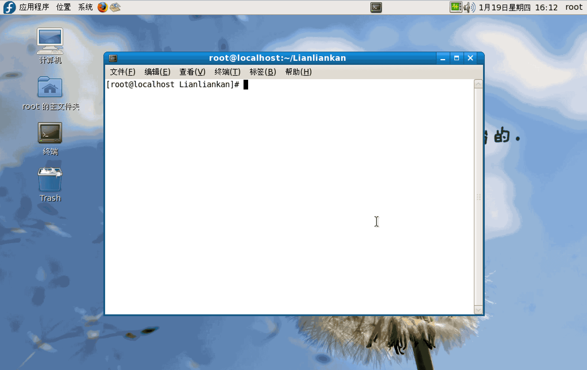

# Lianliankan

`Lianliankan` is a small game based on SDL(1.x).

If you want to know more about this game,you can read in [Wikipedia](https://zh.wikipedia.org/wiki/%E8%BF%9E%E8%BF%9E%E7%9C%8B) or [Baidu Encyclopedia](http://baike.baidu.com/subview/27579/27579.htm)


## Demonstration

### Linux



### ARM(UP-6410)

you can watch this vedio on [youtube](https://youtu.be/v83GaKbmx8w) or [youku](http://v.youku.com/v_show/id_XMjQ3NzQwMTczMg==)

## How to Run
1.You need to install the SDL environment on a PC or ARM development board

2.Use makefile to compile the program

3.Usage ./xxx to run this game


***cli***			Character interface in Linux

***gui***   		graphic interface in Linux

***armgui*** 		graphic interface in ARM

## Notice

You can change the map size of the game at any time.
```
main.c
#define GRID_ROWS	4
#define GRID_COLS	4

```

## License
Lianliankan is available under the MIT license. See the [LICENSE](./LICENSE)
file for more info.
